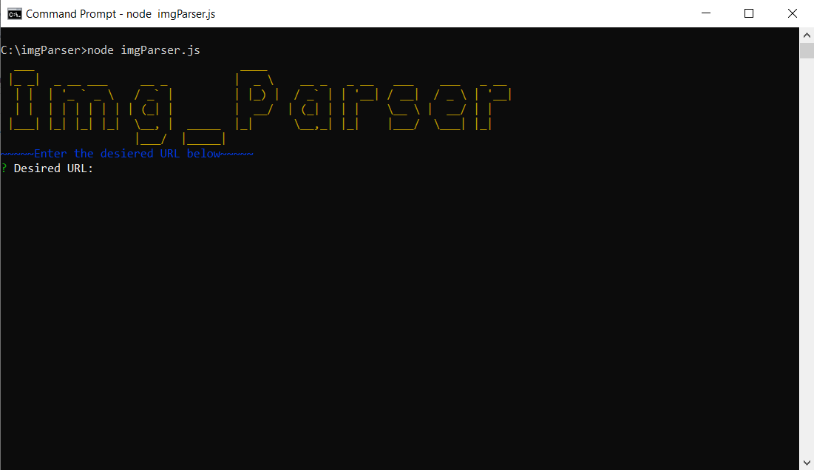
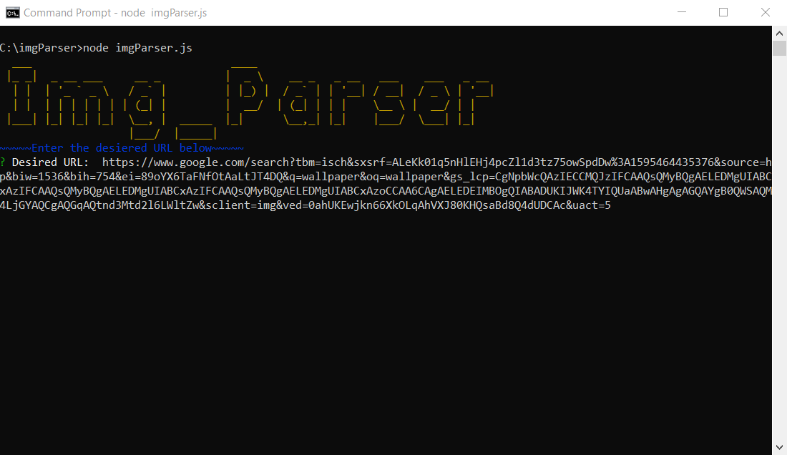
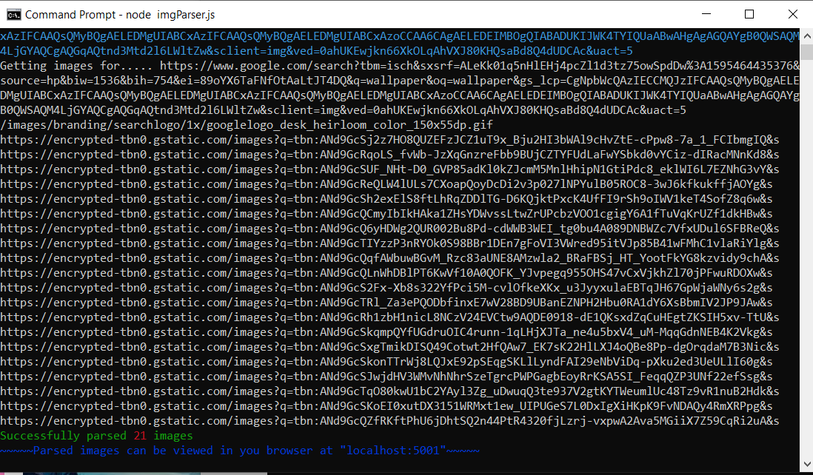
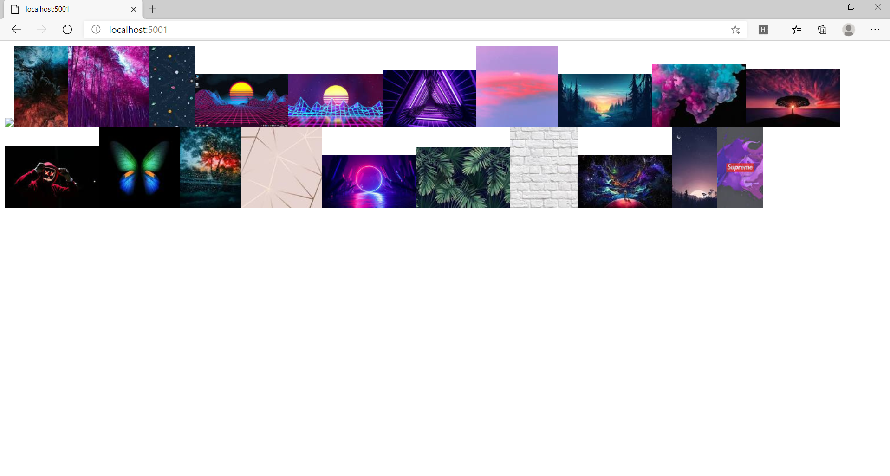

# Node.Js_ImageParser
Parses all images from any given URL. Works within the console, returns the image sources, and sets up a server on localhost:5051, where it writes all the parsed images to a document for you to see.

  

<b>Setup & Use:</b>

1. This script runs on Node.js so if you do not already have it downloaded you can dowload it here ----> https://nodejs.org/en/

2. Once Node.js is installed simply download the repository or <b><i>git clone</i></b> it

3. After the repository is installed open the console on your machine and <b><i>cd</i></b> into the repository folder

4. Once you are in the repository folder run the <b><i>npm init</i></b> command to download the needed node modules

5. After the node modules are finished downloading you can now run the image parser by running the command <b><i>node imgParser.js</i></b>

6. If it is properly setup, you should see "Img_Parser" displayed in the console window once loaded

7. It should now prompt you for the URL you wish to parse the images from

8. Simply enter the desired URL and click "Enter" to run the parser

9. It should now grab all of the image DOM elements from the given URL and log each images source in the console window

10. Lastly, it also will setup a server on "localhost:5051" or "127.0.0.1:5001" where it will write all of the images to a browser document for you to view them

   

<b>Example (using a Google images URL):</b>

Open parser by running <b><i>node imgParser.js </i></b>

  

Enter the desired URL you want to parse images from

  

Press "Enter" and it will log the images sources in the console window

  

Open your browser and go to "localhost:5051" to view the images that were parsed

